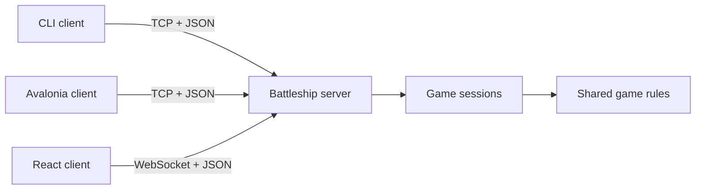

# Battleship

A console Battleship game in C#, split into an offline client and a TCP server for online play.

## Projects
- [Battleship.Client/](Battleship.Client/) — Console client: main menu, game runner, and views.
- [Battleship.Server/](Battleship.Server/) — TCP server (`IPAddress.Any:50000`). Currently accepts one client and echoes messages.
- [Battleship.Shared/](Battleship.Shared/) — Shared models (`Board`, `GridSpot`, `Player`, `Ships`) and `BoardLogic`.



## Run

```bash
# Client
dotnet run --project Battleship.Client

# Server
dotnet run --project Battleship.Server
```

## Rules
10×10 grid. Each player hides a fleet, then players take turns firing at coordinates (e.g. `B3`) for a *hit* or *miss*. Sink all enemy ships to win.

